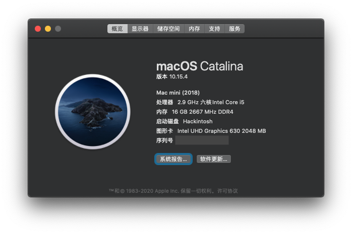

# Deskmini 310 Hackintosh

## Tech Specs

| | |
| ------------- | ------------- |
| OS | macOS Catalina 10.15.x (SMBIOS: Macmini8,1) |
| OpenCore | 0.5.9 |
| CPU | Intel i5-9400 |
| GPU | Intel UHD Graphics 630 |
| RAM | ADATA DDR4 2666 8GB x 2 |
| SSD | Kioxia RC10 500G |
| Wi-Fi & Bluetooth | BCM94360CS2 |
| Monitor | DELL P2415Q |

## Works

* Ethernet ✅
* Wi-Fi ✅
* Bluetooth ✅
* Audio ✅
* Sleep & Wake ✅
* CPU Frequency ✅
* Hand Off / iCloud ✅

## BIOS settings (Version: P4.40)

Load UEFI Defaults

* Advanced
  - Chipset Configuration
    - Onboard HD Audio: Enabled
  - USB Configuration
    - XHCI Hand-off: Enabled
  - Super IO Configuration
    - Serial Port: Disabled
  - CPU Configuration
    - C States Support: Enabled
      - CFG Lock: Disabled
* Security
  - Security Boot: Disabled
* Boot
  - CSM: Disabled

## Issues

* Crashed after wake from sleep: enable PowerTimeoutKernelPanic option in config.plist
