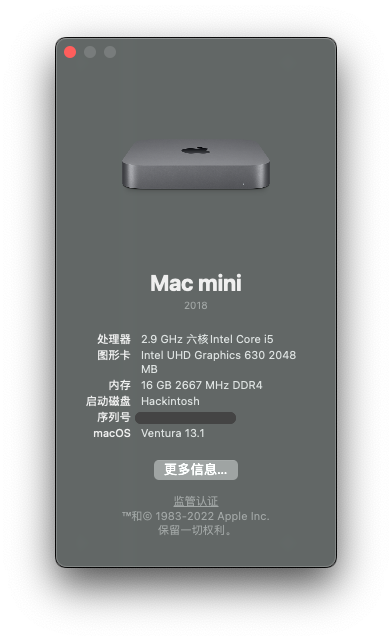

# Deskmini 310 Hackintosh

## Tech Specs

| | |
| ------------- | ------------- |
| OS | macOS Ventura 13.1 (SMBIOS: Macmini8,1) |
| OpenCore | 0.8.7 |
| CPU | Intel i5-9400 |
| GPU | Intel UHD Graphics 630 |
| RAM | ADATA DDR4 2666 8GB x 2 |
| SSD | Kioxia RC10 500G |
| Wi-Fi & Bluetooth | BCM94360CS2 |
| Monitor | DELL P2415Q (4K@60Hz) |

## Works

* Ethernet ✅
* Wi-Fi ✅
* Bluetooth ✅
* Audio ✅
* Sleep & Wake ✅
* CPU Frequency ✅
* Hand Off / iCloud ✅

## BIOS settings (Version: P4.40)

Load UEFI Defaults

* Advanced
  - Chipset Configuration
    - Onboard HD Audio: Enabled
  - USB Configuration
    - XHCI Hand-off: Enabled
  - Super IO Configuration
    - Serial Port: Disabled
  - CPU Configuration
    - C States Support: Enabled
      - CFG Lock: Disabled
* Security
  - Security Boot: Disabled
* Boot
  - CSM: Disabled

## Misc

* Crash after waking up from sleep: enable `PowerTimeoutKernelPanic` option in config.plist
* Remove `-v` from `boot-args` in config.plist if you don't want the debug mode

## Tools

* [OpenCore-Desktop-Guide](https://dortania.github.io/OpenCore-Desktop-Guide/) : OpenCore manual
* [gibMacOS](https://github.com/corpnewt/gibMacOS) : Download macOS
* [ProperTree](https://github.com/corpnewt/ProperTree) : Universal plist editor
* [GenSMBIOS](https://github.com/corpnewt/GenSMBIOS) : Generate SMBIOS data
* [Apple Check Coverage page](https://checkcoverage.apple.com/)

## Credits

[xjn819 blog](https://blog.xjn819.com/?p=7)
